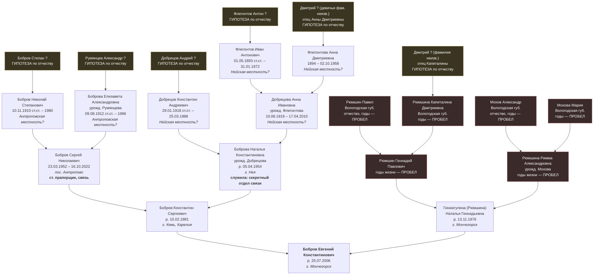

# Родословное древо — текущее состояние

> Обновлено 2026-09-20 после Блока A. Источник связей — `src-001` (семейная база в `public/index.html`),
> источник географии и военной линии — `src-002` (интервью с Евгением).
> **Ни одна связь пока не подтверждена документом.** Всё ниже — [ГИПОТЕЗА] со слов семьи,
> вероятность высокая (данные собраны самой семьёй), но архивной проверки не проходило.

## 0. География рода

```
  КОСТРОМСКАЯ ОБЛАСТЬ                        ВОЛОГОДСКАЯ ОБЛАСТЬ
  два соседних района на одной ж/д           место не уточнено

  АНТРОПОВО            НЕЯ                        ?
  Бобровы              Добрецовы                  Рюмшины
  Румянцевы            Флегонтовы                 Моховы
     │                    │                          │
     └──── дед Сергей ────┘                          │
           ст. прапорщик, связь                      │ вероятно
           бабушка Наталья                           │ вербовка на
           секретный отдел связи                     │ «Североникель»
                    │                                │
                    ▼                                ▼
   г. КЕМЬ (Карелия) ──────────────────►  г. МОНЧЕГОРСК, «27-й км»
   1981: рождение отца                    1976: рождение матери
                                          2006: рождение Евгения
```

Дед и бабушка родились в **соседних районах** — Антропове и Нее, примерно в 40 км друг от друга на одной железнодорожной линии, — оба пошли служить **в связь** и встретились, вероятнее всего, уже в гарнизоне. [ФАКТ по местам и роду войск — src-003; место знакомства — ГИПОТЕЗА, вероятность высокая]

Обе половины рода — **северно-великорусские, из соседних губерний**, и обе независимо друг от друга оказались на Кольском полуострове: Бобровы по службе, Рюмшины — вероятно, по работе. Встретились родители Евгения уже в Мончегорске. [ФАКТ по местам — src-002; причина переезда Рюмшиных — ГИПОТЕЗА, вероятность средняя]

| Ветвь | Откуда | Архив |
|---|---|---|
| Бобровы, Румянцевы | **пос. Антропово, Антроповский р-н, Костромская обл.** | **ГАКО** |
| Добрецовы, Флегонтовы | **г. Нея, Нейский р-н, Костромская обл.** | **ГАКО** |
| Рюмшины | Вологда / Вологодская обл. | **ГАВО** |
| Моховы | Вологда / Вологодская обл. | **ГАВО** |
| Саловьевы | **[ПРОБЕЛ]** | — |

**Что уточнено, что нет.** Костромская сторона сузилась до двух районов. **Вологодская осталась без уточнения** — город это или область, неизвестно.

**Ловушка, которую нельзя пропустить.** Антропово и Нея — пристанционные посёлки, выросшие вокруг железной дороги в XX веке. Прадеды 1893–1919 годов рождения родились, почти наверняка, **не в них, а в окрестных деревнях**. Для метрической книги нужно название деревни и приход, а не название района.

**Смена областной принадлежности территории:** до 1929 — Костромская губерния, 1929–1936 — Ивановская Промышленная обл., **1936–1944 — Ярославская обл.**, с 13.08.1944 — Костромская обл. Документы за 1936–1944 гг. могли осесть в **ГАЯО (Ярославль)**.

## 1. Прямая восходящая линия Евгения

Точка отсчёта: **Бобров Евгений Константинович**, р. 25.07.2006 (`bobrov-evgeniy-2006`).



**Глубина по линиям (от Евгения вверх):**

| Линия | Последний известный предок | Поколений вглубь | Предельный год |
|---|---|---|---|
| Бобров (отец → отец → отец) | Бобров Николай Степанович | +3 (прадед) | 1910 |
| Румянцев (через прабабушку Елизавету) | Румянцева Елизавета Александровна | +3 | 1912 |
| Добрецов | Добрецов Константин Андреевич | +3 | 1918 |
| **Флегонтов (самая глубокая)** | **Флегонтов Иван Антонович** | **+4 (прапрадед)** | **1893** |
| Рюмшин | Рюмшин Павел | +4, но без дат | — |
| Мохов | Мохов Александр | +4, но без дат | — |
| Саловьев/Соловьёв | Саловьев Василий Петрович | не привязан к древу | 1918 |

Все даты рождения до 14.02.1918 в таблице даны **по старому стилю** — так, как они будут записаны в метрической книге.

**Итого:** максимальная документированная глубина — **5 поколений** (Евгений → отец → дед → прадед → прапрадед Флегонтов Иван Антонович, р. 1893). Всё, что глубже 1893 года, — **[ПРОБЕЛ]**.

## 2. «Флегонт» — конфликт в вершине древа

В базе есть персона `id=1, «Флегонт»`, поколение 0, записанная как отец Флегонтова Ивана **Антоновича**.

- Отчество Ивана — **Антонович**, значит его отца звали **Антон**, а не Флегонт. [ФАКТ — следует из самого отчества в src-001]
- «Флегонт» — это, скорее всего, реконструкция происхождения фамилии (Флегонтов ← Флегонт), а не реальный записанный предок. [ГИПОТЕЗА, вероятность высокая]
- Флегонт как родоначальник фамилии мог жить на 2–4 поколения раньше Ивана — это не отец, а отдалённый предок.

**Решение:** запись `flegont-0000` сохранена, но помечена как непроверенная реконструкция; отдельно заведён [ПРОБЕЛ] «Флегонтов Антон — отец Ивана, 1860–1875 г.р.». См. `research/open-questions.md`.

## 3. Ветви в ширину (боковые линии)

Всего в базе **101 персона**, 7 поколений (условные номера 0–6).

| Поколение | Чел. | Состав |
|---|---|---|
| 0 | 1 | «Флегонт» (реконструкция, см. выше) |
| 1 | 2 | Флегонтовы Иван Антонович и Анна Дмитриевна |
| 2 | 12 | 8 прадедов/прабабушек + 3 их сиблинга + Саловьев В.П. |
| 3 | 26 | деды/бабушки + двоюродные деды и бабушки |
| 4 | 27 | родители, дяди/тёти, двоюродные дяди/тёти |
| 5 | 23 | Евгений, сестра, двоюродные и троюродные |
| 6 | 10 | младшее поколение (племянники) |

**Четыре прадедовские ветви и их состояние:**

1. **Бобровы** (Николай Степанович + Елизавета Румянцева) — самая широкая: 8 детей (Анатолий 1937, Борис 1947, Александра 1950, Валентина 1950, Сергей 1952 — дед Евгения, Галина 1954, Алевтина, Галина). Большая семья → высокая вероятность найти живых информантов.
2. **Добрецовы** (Константин Андреевич + Анна Флегонтова) — 3 детей: Владимир 1947, Ольга 1955, Наталья 1954 (бабушка Евгения). Через Анну выходит на Флегонтовых — **самая перспективная линия для архива**: костромская, глубокая, с редкой фамилией.
3. **Рюмшины** (Павел + Капиталина Дмитриевна) — 3 сына: Геннадий (дед), Рудик, Юрий. **Ни одной даты во всей ветви.** Родом из-под Вологды; к 1976 г. семья уже в Мончегорске.
4. **Моховы** (Александр + Мария) — 4 детей: Римма (бабушка), Александра, Тамара, Юрий. **Ни одной даты во всей ветви.** Родом из-под Вологды.

## 4. Оборванная ветвь: Саловьевы

9 человек образуют **отдельный, ни к чему не присоединённый кусок древа**:

```
Саловьев Василий Петрович (1918 – 1941)   ← помечен «Прадедушка», но связи с Евгением нет
  └── Анисимова Людмила Васильевна (р. 01.05.1939)   ← помечена «Двоюродная бабушка»
        └── Абелева Татьяна Николаевна (р. 08.07.1968)
              ├── Свинарчук Наталья Артуровна (р. 29.07.1988)
              │     ├── Харитонова Лиза Алексеевна (р. 02.04.2005)
              │     └── Михаил Юрьевич (р. 23.10.2009)
              └── Смирнова Дарья Артуровна (р. 15.11.1989) × Смирнов Алексей
                    └── Смирнова Анна Алексеевна (р. 11.09.2015)
```

Метки родства противоречат друг другу: если Василий Петрович — прадед, то Людмила Васильевна — двоюродная бабушка Евгения только при условии, что она **не** дочь прадеда, а дочь его брата. Точку стыковки этой ветви с древом надо выяснить у семьи — это вопрос №2 по приоритету. См. `research/open-questions.md`.

## 5. Военная линия — служили оба

**Бобров Сергей Николаевич** (23.03.1952 – 16.10.2022) — **старший прапорщик, войска связи**. Мончегорский гарнизон, место службы **«27-й километр»**; ранее — **г. Кемь**, Карелия (1981). [ФАКТ — src-003]

**Боброва (Добрецова) Наталья Константиновна** (р. 05.04.1954) — **служила сама**: секретный отдел связи войсковой части, затем материально-техническое снабжение. Жива. [ФАКТ — src-003]

**Почему это главный архивный ключ отцовской половины древа.** Служили оба — значит послужных документов **два, и они закрывают обе линии сразу**:

| Личное дело | Даёт родителей |
|---|---|
| деда Сергея Николаевича | Бобров Николай Степанович + Румянцева Елизавета Александровна |
| бабушки Натальи Константиновны | Добрецов Константин Андреевич + Флегонтова Анна Ивановна |

В личном деле: место рождения, национальность, социальное происхождение, состав семьи с ФИО и годами рождения родителей, все части и гарнизоны с датами, звания, награды.

**Датировка по званию** [ГИПОТЕЗА, вероятность высокая]: звание прапорщика введено в 1972 г., старшего прапорщика — в 1981 г. Значит служба шла с 1970-х и продолжалась после 1981 г. — что сходится с рождением сына в Кеми в феврале 1981 г.

**Чего не хватает:** номера войсковой части. Он есть в военном билете деда (документы дома сохранились, доступа пока нет) и, вероятно, в памяти бабушки. См. `research/search-plan.md`, трек −1.

## 6. Полное древо в виде списка

Полный список персон с файлами карточек — `README.md`. Индивидуальные карточки — `people/*.md`.
